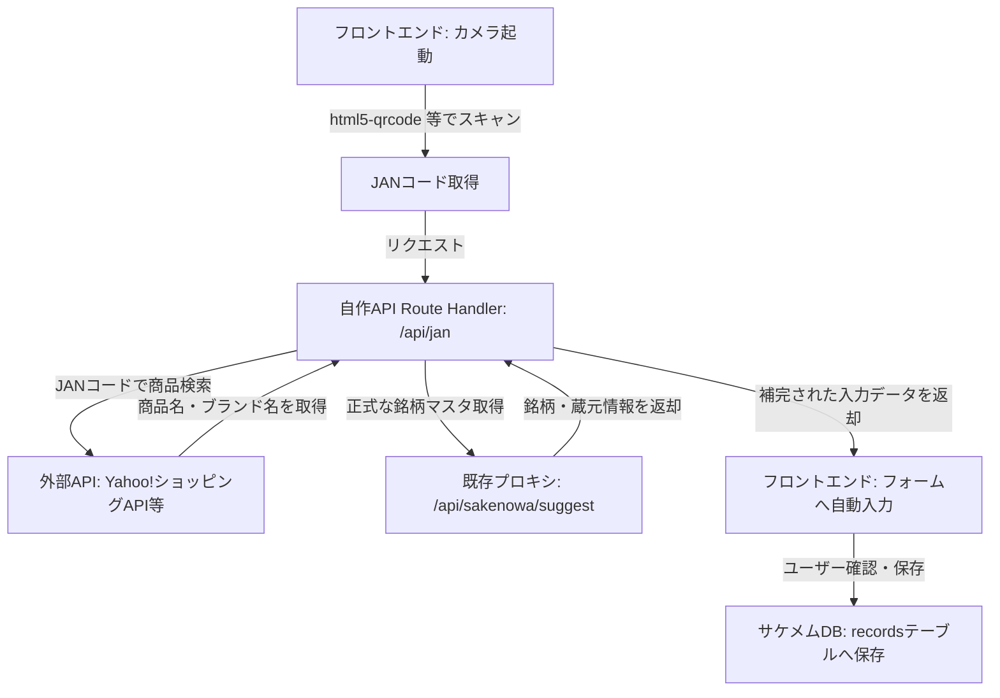

# 直近の改善提案とJANコード連携設計 (Development Context)

本ドキュメントは、ライフログアプリ「Sakemem」の開発において、直近で提示されたバックエンド・DB層の改善項目、およびボトルラベル入力自動化（JANコード連携）の設計方針をまとめたものです。基本設計については [Sakemem_Context.md](../Sakemem_Context.md) を参照してください。

---

## 1. 直近のレビュー・改善提案（バックエンド・DB層）

### ① セキュリティの強化
* **対策:** Server Actions 内で必ず `supabase.auth.getUser()` を呼び出し、サーバー側で検証した安全な `user_id` を用いてDB書き込みや更新を行う。クライアントから送られてくる `user_id` を盲信しない。

### ② トランザクションと整合性の確保
* **対策:** ペアリングの解除・マージといった複数レコードにまたがる更新処理において、データ不整合や中途半端な更新を防ぐため、エラーハンドリングを徹底する。必要に応じて PostgreSQL のストアドファンクション（RPC）化を検討する。

### ③ パフォーマンス向上（タイムライン）
* **対策:** データ件数の増加に対応するため、タイムライン一覧表示において `.range(from, to)` を用いた無限スクロール（パジネーション）の実装を視野に入れる。

### ④ 型定義の厳密化 (`flavor_metrics`)
* **対策:** `flavor_metrics` の型定義を `Record<string, number>` から、各カテゴリ・スタイルごとに許容される評価軸キー（例: `sweetness`, `acidity`, `bitterness` 等）を制限した厳密な Union 型にリファクタリングする。

---

## 2. 新機能：ボトルラベル入力自動化（バーコード/JANコード連携）

ラベルのOCR認識は「湾曲」「光沢」「デザイン文字」等による誤認識率が高いため、確実性の高い**JANコード（バーコード）スキャン**を本命案として採用する。

### JANコード連携の理想的なUXパイプライン

#### 各コンポーネントの役割と実装方針
1. **フロントエンド（バーコードスキャン）:**
   * `html5-qrcode` などの軽量なライブラリを用いて、スマートフォンのカメラからJANコード（バーコード）を読み取る。
2. **Route Handler (`/api/jan`):**
   * JANコードを受け取り、Yahoo!ショッピングAPI等の商品検索APIを呼び出す。
   * 取得したテキスト（商品名やブランド名）を元に、既存の日本酒サジェスト機能（`/api/sakenowa/suggest`）等へ問い合わせを行い、正規の銘柄・蔵元データを揺らぎなく取得する。
   * 取得結果をフロントエンドに返し、記録フォームの初期入力値として自動設定する。
