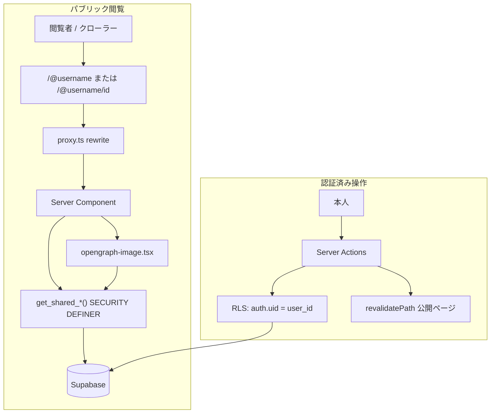

# Sakemem 共有機能 — 本実装計画

> 作成日: 2026-06-28  
> ステータス: 実装待ち  
> 関連: [sharing-feature.md](./sharing-feature.md)（設計メモ・背景）、[Sakemem_Context.md](../Sakemem_Context.md)、[performance-improvement.md](./performance-improvement.md)

本ドキュメントは [sharing-feature.md](./sharing-feature.md) の **Phase A** を、会話で確定したスコープに絞った **実装手順書** である。背景・方針の議論は設計メモを参照し、本書では DB・API・画面・OGP・工数まで落とし込む。

---

## 1. 確定スコープ

### 1.1 含める（今回実装）

| 項目 | 内容 |
| :--- | :--- |
| プロフィール | `profiles` テーブル、`username`（公開 URL 用）、`display_name`、`avatar_url`、`bio` |
| プロフィール編集 | `/settings/profile` — `username` / `display_name` / `avatar_url` / `bio` の変更 |
| プロフィール画像 | Supabase Storage `profile-images` → `profiles.avatar_url` |
| 公開範囲 | 記録ごとに `private` / `unlisted` / `public`（デフォルト `private`） |
| 場所マスク | `hide_place_when_shared` — 共有時に `place` を非表示 |
| 公開プロフィール | `/@username` — `public` 記録のみ一覧（ペアカード） |
| 記録共有ページ | `/@username/[id]` — `unlisted` / `public` の閲覧専用ページ |
| 外部共有 UI | URL コピー、X intent、モバイル向け Web Share API |
| 動的 OGP | 記録・プロフィールごとに `title` / `description` / **動的 OG 画像** |
| 既存ユーザー | 初回ログイン時に `username` 設定オンボーディング |
| URL rewrite | `/@username` → 内部 `/profile/[username]` |

### 1.2 含めない（Phase B / 将来）

- フォロー・フレンド・申請（`friendships`）
- `visibility = 'friends'`（DB にも入れない。3 値のみ）
- `/feed`、`/friends`、`/recommendations`
- ウィッシュリスト、おすすめ集約サジェスト
- 旧 `username` からの URL リダイレクト（変更後の旧 URL は 404）
- 全文検索・銘柄マスター・アフィリエイト

### 1.3 プロダクト上の振る舞い

```
private   → 本人のみ。共有 URL は 404。
unlisted  → URL を知っている人のみ。プロフィール一覧には出ない。
public    → 誰でも。プロフィール一覧 + 直接 URL の両方から到達可能。
```

共有の取り消し: `visibility` を `private` に戻すと即非公開（既知 URL も 404）。

---

## 2. 工数見積もり

| 区分 | 人日 |
| :--- | ---: |
| Step 1: profiles + オンボーディング | 3.5〜4.5 |
| Step 1b: プロフィール設定 + 画像アップロード | 2.0〜3.0 |
| Step 2: visibility + 共有取得（DB / RLS） | 2.5〜3.5 |
| Step 3: 公開ページ（プロフィール・共有記録） | 3.5〜4.5 |
| Step 4: 動的 OGP（メタデータ + OG 画像） | 2.5〜3.5 |
| Step 5: 編集 UI + 共有ボタン | 2.0〜2.5 |
| Step 6: QA・ドキュメント・本番検証 | 1.5〜2.0 |
| **合計** | **17.5〜23.5 人日** |

**カレンダー換算:** 1 人フルタイムで **約 3.5〜5 週間**。

動的 OGP は静的 1 枚案（設計メモ）より **+2.5〜3.5 人日** 増。フォント読み込み・日本語レンダリング・Vercel 上でのプレビュー検証が主な追加工数。

---

## 3. アーキテクチャ概要

### 3.1 レンダリング方針

[performance-improvement.md](./performance-improvement.md) のハイブリッド構成を維持する。

| 領域 | ルート | 方式 |
| :--- | :--- | :--- |
| プライベート | `/records` 系 | クライアントサイド・フィルタ + `loading.tsx`（現状維持） |
| パブリック | `/@username`、`/@username/[id]` | **SSR** + `generateMetadata` + `opengraph-image.tsx` |

クローラー（X / Facebook 等）は JS なしで HTML 内の `og:*` と OG 画像 URL を読む必要があるため、共有ページは Server Component のまま実装する。

### 3.2 データフロー



### 3.3 共有取得の方針（推奨）

`anon` ロールに `records` テーブルへ広い SELECT ポリシーを足すのではなく、**SECURITY DEFINER 関数** で公開フィールドのみ返す。

理由:

- `user_id`・`private` レコードの漏洩リスクを関数内で一元管理できる
- `username` と `records.user_id` の一致検証を SQL 内で強制できる
- 404 の条件（`private` / 存在しない / username 不一致）を統一できる

---

## 4. データベース

### 4.1 マイグレーション

ファイル名案: `supabase/migrations/005_sharing_and_profiles.sql`

```sql
-- profiles
CREATE TABLE public.profiles (
  id           uuid        PRIMARY KEY REFERENCES auth.users(id) ON DELETE CASCADE,
  username            text        NOT NULL,
  display_name        text        NOT NULL,
  avatar_url          text,                  -- プロフィール画像 URL（Storage 公開 URL）
  bio                 text,
  created_at          timestamptz NOT NULL DEFAULT now(),
  updated_at          timestamptz NOT NULL DEFAULT now(),

  CONSTRAINT profiles_username_format CHECK (
    username ~ '^[a-zA-Z0-9_-]{3,30}$'
  )
);

CREATE UNIQUE INDEX profiles_username_key ON public.profiles (lower(username));

-- records 拡張
ALTER TABLE public.records
  ADD COLUMN visibility text NOT NULL DEFAULT 'private',
  ADD COLUMN hide_place_when_shared boolean NOT NULL DEFAULT false;

ALTER TABLE public.records
  ADD CONSTRAINT records_visibility_check CHECK (
    visibility IN ('private', 'unlisted', 'public')
  );

CREATE INDEX records_user_public_idx
  ON public.records (user_id, date DESC, created_at DESC)
  WHERE visibility = 'public';

-- プロフィール画像用 Storage（マイグレーションまたは Dashboard で作成）
-- バケット名: profile-images（public: true）
-- パス例: {user_id}/{uuid}.webp
-- RLS: authenticated のみ自分の user_id プレフィックスへ INSERT/UPDATE/DELETE
```

**`friends` は初版では CHECK に含めない。** Phase B 時に `ALTER` で追加する。

### 4.2 profiles RLS

| ポリシー | 操作 | 条件 |
| :--- | :--- | :--- |
| `profiles_select_public` | SELECT | 常に可（公開カラムのみ。機密は持たない） |
| `profiles_insert_own` | INSERT | `auth.uid() = id` |
| `profiles_update_own` | UPDATE | `auth.uid() = id` |
| `profiles_delete_own` | DELETE | `auth.uid() = id`（通常は CASCADE で不要だが明示可） |

### 4.3 共有取得 RPC

```sql
-- 返却型は公開に必要なカラムのみ（user_id は返さない）
CREATE OR REPLACE FUNCTION public.get_shared_record(
  p_username text,
  p_record_id uuid
)
RETURNS TABLE (
  id uuid,
  pair_id uuid,
  date date,
  category text,
  name text,
  producer text,
  style text,
  sub_info text,
  place text,
  rating integer,
  flavor_metrics jsonb,
  comment text,
  visibility text,
  hide_place_when_shared boolean,
  -- 投稿者
  profile_username text,
  profile_display_name text,
  profile_bio text,
  profile_avatar_url text
)
LANGUAGE sql
STABLE
SECURITY DEFINER
SET search_path = public
AS $$
  SELECT
    r.id, r.pair_id, r.date, r.category, r.name, r.producer, r.style,
    r.sub_info,
    CASE WHEN r.hide_place_when_shared THEN NULL ELSE r.place END AS place,
    r.rating, r.flavor_metrics, r.comment, r.visibility,
    r.hide_place_when_shared,
    p.username, p.display_name, p.bio, p.avatar_url
  FROM public.records r
  INNER JOIN public.profiles p ON p.id = r.user_id
  WHERE p.username ILIKE p_username   -- lower(username) インデックスと整合
    AND r.id = p_record_id
    AND r.visibility IN ('unlisted', 'public');
$$;

CREATE OR REPLACE FUNCTION public.get_public_profile(
  p_username text
)
RETURNS TABLE (
  id uuid,
  username text,
  display_name text,
  bio text,
  avatar_url text
)
LANGUAGE sql
STABLE
SECURITY DEFINER
SET search_path = public
AS $$
  SELECT id, username, display_name, bio, avatar_url
  FROM public.profiles
  WHERE username ILIKE p_username;
$$;

CREATE OR REPLACE FUNCTION public.get_public_profile_records(
  p_username text,
  p_limit integer DEFAULT 50,
  p_offset integer DEFAULT 0
)
RETURNS SETOF public.records
LANGUAGE sql
STABLE
SECURITY DEFINER
SET search_path = public
AS $$
  SELECT r.*
  FROM public.records r
  INNER JOIN public.profiles p ON p.id = r.user_id
  WHERE p.username ILIKE p_username
    AND r.visibility = 'public'
  ORDER BY r.date DESC, r.created_at DESC
  LIMIT p_limit OFFSET p_offset;
$$;
```

`GRANT EXECUTE ON FUNCTION ... TO anon, authenticated;` を忘れないこと。

ペア表示時は、共有記録ページ側で `pair_id` があれば同一 `pair_id` かつ同一 `user_id`（RPC 経由で本人の公開記録のみ）の関連レコードを追加取得する。ペアの片方が `private` の場合は **ペア結合せず単体表示** とする（または 404 — 実装時に Step 3 で決定、推奨は単体表示）。

### 4.4 既存ユーザー移行

- 既存 `auth.users` に `profiles` 行がないユーザーは、ログイン後 `/onboarding/profile` へリダイレクト
- `proxy.ts` で `/records` 保護時に `profiles` 存在チェックを追加
- `username` 未設定の間は記録 CRUD は可能にするか、オンボーディング完了までブロックするか → **推奨: 閲覧・記録は可、共有ボタンのみ無効（username 必須）**

---

## 5. ルーティング

### 5.1 外部 URL（正）

| URL | 説明 |
| :--- | :--- |
| `/@{username}` | 公開プロフィール |
| `/@{username}/{recordId}` | 記録共有ページ |

### 5.2 内部実装パス

App Router では `@` 始まりのディレクトリが Parallel Routes 用のため、内部は `/profile/` を使う。

| 内部パス | ファイル |
| :--- | :--- |
| `/profile/[username]` | `src/app/profile/[username]/page.tsx` |
| `/profile/[username]/[id]` | `src/app/profile/[username]/[id]/page.tsx` |

### 5.3 proxy.ts の rewrite

`src/proxy.ts` の `updateSession` 呼び出し前に rewrite を挿入する。

```ts
// 疑似コード
const { pathname } = request.nextUrl;

const profileMatch = pathname.match(/^\/@([^/]+)$/);
if (profileMatch) {
  url.pathname = `/profile/${profileMatch[1]}`;
  return NextResponse.rewrite(url);
}

const recordMatch = pathname.match(/^\/@([^/]+)\/([^/]+)$/);
if (recordMatch) {
  url.pathname = `/profile/${recordMatch[1]}/${recordMatch[2]}`;
  return NextResponse.rewrite(url);
}
```

**認証リダイレクトの対象外** にする（`isProtectedPage` は `/records` のみのまま）。

共有 URL の組み立て:

```ts
// src/lib/sharing/build-share-url.ts
export function buildRecordShareUrl(username: string, recordId: string): string {
  const base = process.env.NEXT_PUBLIC_SITE_URL!.replace(/\/$/, "");
  return `${base}/@${username}/${recordId}`;
}

export function buildProfileUrl(username: string): string {
  const base = process.env.NEXT_PUBLIC_SITE_URL!.replace(/\/$/, "");
  return `${base}/@${username}`;
}
```

---

## 6. アプリケーション層

### 6.1 新規ディレクトリ

```
src/lib/
├── profiles/
│   ├── repository.ts           # CRUD（認証済み）
│   ├── validate-username.ts
│   ├── upload-avatar.ts        # Storage アップロード・リサイズ
│   └── types.ts
├── sharing/
│   ├── build-share-url.ts
│   ├── build-share-text.ts # X 投稿用テンプレート
│   ├── fetch-shared.ts     # RPC ラッパー
│   └── mask-record.ts      # place マスク済みビュー
└── metadata/
    ├── site.ts             # metadataBase, siteName, デフォルト
    ├── build-metadata.ts   # openGraph / twitter 共通
    ├── record-share.ts     # 記録用 title / description 生成
    └── public-profile.ts   # プロフィール用

src/app/
├── actions/
│   └── profiles.ts         # createProfile, updateProfile, uploadAvatar
├── onboarding/
│   └── profile/
│       └── page.tsx        # 初回プロフィール設定
├── settings/
│   └── profile/
│       └── page.tsx        # プロフィール編集
└── profile/
    ├── layout.tsx          # 公開用レイアウト（Header 簡略化検討）
    └── [username]/
        ├── page.tsx
        ├── opengraph-image.tsx
        └── [id]/
            ├── page.tsx
            └── opengraph-image.tsx

src/components/
├── profiles/
│   ├── profile-settings-form.tsx   # オンボーディング・設定で共用
│   ├── profile-avatar-upload.tsx   # avatar_url 選択・プレビュー
│   └── username-field.tsx          # 利用可否チェック付き入力
└── sharing/
    ├── share-button.tsx
    └── visibility-selector.tsx
```

### 6.2 変更ファイル

| ファイル | 変更概要 |
| :--- | :--- |
| `src/lib/types/record.ts` | `visibility`, `hide_place_when_shared` |
| `src/lib/records/repository.ts` | 更新時に visibility 対応 |
| `src/lib/records/parse-form.ts` | 公開範囲・マスクのパース |
| `src/app/actions/records.ts` | create/update + `revalidatePath` 公開 URL |
| `src/proxy.ts` | rewrite + プロフィール未設定リダイレクト |
| `src/components/records/edit-record-form.tsx` | 公開範囲 UI |
| `src/components/records/record-detail.tsx` | 投稿者表示、`hidePlace`、共有向け props |
| `src/components/records/timeline.tsx` | 共有ボタン（条件付き表示） |
| `src/app/layout.tsx` | `metadataBase`, title template |
| `src/components/layout/header.tsx`（等） | 「プロフィール設定」リンク追加 |
| 各 `page.tsx` の `metadata` | ページ別 OGP / robots（§7） |

### 6.3 Server Actions — revalidatePath

記録の `visibility` 変更・更新・削除時、およびプロフィール更新時に、影響する公開 URL を再検証する。

```ts
revalidatePath(`/@${username}`);           // 外部 URL 形式で指定
revalidatePath(`/@${username}/${recordId}`);
// username 変更時は旧 username のパスも revalidate（404 に更新）
revalidatePath(`/@${oldUsername}`);
// 内部パスでも可: /profile/${username} 等 — 実装時にどちらが効くか build で確認
```

プロフィールの `display_name` / `avatar_url` / `bio` 変更時は `revalidatePath(\`/@${username}\`)` と、当該ユーザーの `public` / `unlisted` 記録共有 URL をまとめて再検証する（件数が多い場合は username 単位の再検証のみでも可）。

---

## 7. OGP 設計（動的）

### 7.1 依存パッケージ

```bash
npm install @vercel/og
```

Next.js 16 の `opengraph-image.tsx` convention を使用。`ImageResponse` で 1200×630 PNG を生成。

### 7.2 フォント

日本語銘柄名・メモ抜粋を描画するため、**Noto Sans JP** 等を `public/fonts/` に配置し `fetch` で読み込む。

```
public/fonts/NotoSansJP-Bold.woff
public/fonts/NotoSansJP-Regular.woff
```

Vercel 本番ではファイルシステムからの読み込みが安定。Google Fonts CDN 直読みは OG 生成時のネットワーク依存になるため非推奨。

### 7.3 ページ別メタデータ

| ページ | `generateMetadata` | `opengraph-image` | `robots` |
| :--- | :---: | :---: | :--- |
| `/` | 静的 | 共通サービス画像 | index |
| `/login`, `/signup` | 静的 | 共通 | index |
| `/records` 系 | 静的 title のみ | なし | **noindex** |
| `/profile/[username]` | 動的 | 動的 | index |
| `/profile/[username]/[id]` | 動的 | 動的 | index（`unlisted` も URL 直アクセスは許可。検索エンジンは robots で noindex にするか要検討 → **推奨: `unlisted` は `noindex`、 `public` のみ index**） |

`unlisted` の `robots`:

```ts
robots: record.visibility === "public"
  ? { index: true, follow: true }
  : { index: false, follow: false },
```

### 7.4 記録共有 OG 画像のレイアウト

**サイズ:** 1200 × 630 px

**描画要素:**

| 要素 | ソース |
| :--- | :--- |
| カテゴリバッジ | `getCategoryLabel(record.category)` |
| 銘柄名（最大 2 行） | `record.name` |
| 蔵元 / メーカー | `record.producer` |
| 総合評価 | `★{rating}` または「評価なし」 |
| ペアおつまみ | `pair_id` から取得した food の `name`（「合わせて: …」） |
| 投稿者 | `@username` または `display_name` + `avatar_url`（小） |
| フッター | `Sakemem` ロゴテキスト |

**描画しない:** `place`（マスク方針と一致）、`comment` 全文（description に短く載せる）、メールアドレス。

### 7.5 記録共有 — title / description

```ts
// title 例
`${record.name} ★${record.rating ?? "—"} | Sakemem`

// description 例（120 文字程度で truncate）
// - comment の先頭
// - ペアがあれば「合わせて: 焼き鳥」
// - producer があれば含める
```

### 7.6 公開プロフィール OG 画像

| 要素 | ソース |
| :--- | :--- |
| 表示名 | `display_name` |
| プロフィール画像 | `avatar_url`（あれば円形クロップで描画） |
| @username | `username` |
| bio 抜粋 | 先頭 80 文字 |
| 公開記録数 | `get_public_profile_records` の件数（別 COUNT RPC でも可） |
| フッター | `Sakemem` |

### 7.7 共通メタデータヘルパー

```ts
// src/lib/metadata/build-metadata.ts
export function buildPageMetadata(input: {
  title: string;
  description: string;
  path: string;           // /@username/id 形式
  imagePath?: string;     // opengraph-image は convention で自動付与可
  robots?: Metadata["robots"];
}): Metadata;
```

`metadataBase` は `src/app/layout.tsx` で一度だけ設定:

```ts
export const metadata: Metadata = {
  metadataBase: new URL(process.env.NEXT_PUBLIC_SITE_URL!),
  title: { default: "Sakemem", template: "%s" },
  description: "お酒とおつまみの晩酌記録アプリ",
};
```

### 7.8 OG 検証チェックリスト

- [ ] 本番 `NEXT_PUBLIC_SITE_URL` が正しい
- [ ] X Card Validator / Facebook Sharing Debugger で記録・プロフィール各 1 件
- [ ] 日本語長文銘柄でレイアウト崩れしないか
- [ ] `visibility` を `private` に戻した後、OG キャッシュは古い場合がある（仕様として許容し、ドキュメントに記載）
- [ ] `unlisted` 記録が Google に index されないこと

---

## 8. UI 仕様

### 8.1 編集画面（`edit-record-form.tsx`）

**セクション「公開設定」** を追加:

| コントロール | 内容 |
| :--- | :--- |
| 公開範囲 | ラジオまたはセレクト: 非公開 / 限定公開（URL） / 公開（プロフィールに表示） |
| 場所を共有しない | チェック `hide_place_when_shared` |

各選択肢に 1 行説明（`unlisted` vs `public` の違いを明確化）。

新規作成フォーム（`record-form.tsx`）への公開設定は **初版では省略可**（デフォルト `private`）。編集画面から設定すれば足りる。

### 8.2 共有ボタン（`share-button.tsx`）

表示条件:

- 本人の記録であること
- `visibility` が `unlisted` または `public`
- `profiles.username` が設定済み

アクション:

1. **URL をコピー** — `navigator.clipboard` + トースト
2. **X で投稿** — `https://twitter.com/intent/tweet?text=...&url=...`（`build-share-text.ts`）
3. **共有…**（`navigator.share` があれば）— モバイル

配置: タイムラインの `RecordDetail` 内（`showActions` 横）または編集ページ上部。

### 8.3 公開プロフィールページ

- ヘッダー: `avatar_url`（またはプレースホルダー）、表示名、`@username`、bio（任意）
- 本文: `public` 記録を `groupRecordsForTimeline` でペア表示
- 空状態: 「まだ公開されている記録はありません」
- 認証不要。編集・削除ボタンなし
- 本人がログイン中に自分の公開プロフィールを見た場合、ヘッダーに「プロフィールを編集」→ `/settings/profile` を表示（任意・推奨）

### 8.4 記録共有ページ

- `RecordDetail` を `showActions={false}` で表示
- 投稿者リンク → `/@username`
- ペアがあればタイムラインと同様のペアカード
- `notFound()` — `private`、存在しない、username 不一致

### 8.5 オンボーディング（`/onboarding/profile`）

| フィールド | 制約 |
| :--- | :--- |
| username | 3〜30 文字、`[a-zA-Z0-9_-]`、一意 |
| display_name | 必須、1〜50 文字程度 |
| avatar_url | 任意（スキップ可） |
| bio | 任意 |

登録直後（メール確認完了 → `/records`）および既存ユーザーの初回ログインで誘導。フォーム UI は §8.6 と `profile-settings-form.tsx` を共用する。

### 8.6 プロフィール設定（`/settings/profile`）

認証必須。オンボーディング完了後いつでもアクセス可能。

#### ルーティング・導線

| 導線 | 説明 |
| :--- | :--- |
| ヘッダー / アカウントメニュー | 「プロフィール設定」 |
| 自分の公開プロフィール | 「プロフィールを編集」（本人のみ） |
| オンボーディング | 初回のみ。完了後は `/settings/profile` へリダイレクト可 |

`proxy.ts` の保護対象に `/settings/*` を追加する（未ログインは `/login` へ）。

#### フォームフィールド

| フィールド | コンポーネント | バリデーション | 備考 |
| :--- | :--- | :--- | :--- |
| `avatar_url` | `profile-avatar-upload.tsx` | JPEG/PNG/WebP、≤ 2 MB | 未設定時は頭文字プレースホルダー |
| `display_name` | テキスト input | 必須、1〜50 文字 | 前後空白 trim |
| `username` | `username-field.tsx` | 3〜30、`^[a-zA-Z0-9_-]+$`、一意 | 変更時は確認ダイアログ |
| `bio` | textarea | 任意、0〜200 文字程度 | |

#### `username` 変更フロー

1. ユーザーが新 username を入力 → debounce 後に `checkUsernameAvailable`（Server Action または RPC）
2. 「保存」押下 → `username` が変わる場合はモーダルで URL 変更を確認
3. Server Action `updateProfile`:
   - 一意性チェック後に `profiles` を更新
   - 旧 username はリダイレクトせず 404
4. 成功後: トースト + `revalidatePath` + 新 `/@username` へのリンク表示

#### `avatar_url` アップロードフロー

1. ファイル選択 → クライアントでプレビュー（`URL.createObjectURL`）
2. 保存時: `uploadAvatar` Server Action
   - 画像をサーバー側で正方形リサイズ（512px）・WebP 化（`sharp` 等）
   - Storage `profile-images/{user_id}/{uuid}.webp` にアップロード
   - 返却 URL を `profiles.avatar_url` に保存
3. 「画像を削除」: `avatar_url = NULL`（Storage オブジェクトの削除はベストエフォート）

#### Server Actions 概要

```ts
// src/app/actions/profiles.ts
export async function createProfile(data: CreateProfileInput): Promise<ActionResult>;
export async function updateProfile(data: UpdateProfileInput): Promise<ActionResult>;
export async function checkUsernameAvailable(username: string): Promise<{ available: boolean }>;
export async function uploadAvatar(formData: FormData): Promise<ActionResult<{ url: string }>>;
export async function removeAvatar(): Promise<ActionResult>;
```

`updateProfile` は `display_name` / `bio` / `username` / `avatar_url` を部分更新可能にする。

#### エラー表示

| エラー | 表示 |
| :--- | :--- |
| username 重複 | 「このユーザー名は使用されています」 |
| username 形式不正 | フィールド下に形式説明 |
| 画像サイズ超過 | 「2 MB 以下の画像を選んでください」 |
| Storage 失敗 | トーストで一般エラー |

---

## 9. セキュリティ

| 項目 | 対策 |
| :--- | :--- |
| デフォルト非公開 | `visibility DEFAULT 'private'` |
| 漏洩防止 | RPC のみで共有取得。`user_id` は公開レスポンスに含めない |
| メール非露出 | 公開面は `username` / `display_name` のみ |
| 列挙攻撃 | UUID v4 + username 一致検証。失敗時はすべて 404（403 にしない） |
| Server Actions | 引き続き `requireUser()`。クライアントの `user_id` は信頼しない |
| `visibility` 改ざん | UPDATE は既存 RLS `records_update_own` のまま |
| プロフィール画像 | Storage RLS で `{user_id}/` プレフィックスのみ書き込み可。公開 URL は読み取り専用 |
| `username` スカッティング | 利用可否 API は存在有無のみ返す（登録済み username の列挙を避けるため、詳細エラーは出さない） |

---

## 10. 実装ステップ（チェックリスト）

### Step 1: profiles 基盤（3.5〜4.5 人日）

- [ ] `005_sharing_and_profiles.sql` — `profiles` テーブル + RLS
- [ ] `src/lib/profiles/*` — 型、バリデーション、repository
- [ ] `src/app/actions/profiles.ts` — create / update
- [ ] `src/app/onboarding/profile/page.tsx` + フォーム
- [ ] `proxy.ts` — プロフィール未設定時 `/onboarding/profile` へ（方針 §4.4 に従う）
- [ ] `validate-username.test.ts`

### Step 1b: プロフィール設定 + 画像（2.0〜3.0 人日）

- [ ] Storage バケット `profile-images` + RLS ポリシー
- [ ] `upload-avatar.ts` — リサイズ・WebP 化・アップロード
- [ ] `profile-settings-form.tsx` / `profile-avatar-upload.tsx` / `username-field.tsx`
- [ ] `src/app/settings/profile/page.tsx`
- [ ] `updateProfile` / `checkUsernameAvailable` / `uploadAvatar` / `removeAvatar`
- [ ] ヘッダーからの導線、公開プロフィールの「編集」リンク（本人のみ）
- [ ] オンボーディングフォームを共用コンポーネントにリファクタ
- [ ] `upload-avatar.test.ts`（MIME・サイズバリデーション）

### Step 2: visibility + RPC（2.5〜3.5 人日）

- [ ] マイグレーション — `visibility`, `hide_place_when_shared`
- [ ] RPC 3 本 + GRANT
- [ ] `src/lib/types/record.ts` 更新
- [ ] `src/lib/sharing/fetch-shared.ts`
- [ ] `repository.ts` / `parse-form.ts` / `actions/records.ts` 更新
- [ ] 手動 SQL テスト（private → 空、public → 取得可）

### Step 3: 公開ページ（3.5〜4.5 人日）

- [ ] `proxy.ts` — `/@` rewrite
- [ ] `src/app/profile/layout.tsx`
- [ ] `profile/[username]/page.tsx` — 一覧
- [ ] `profile/[username]/[id]/page.tsx` — 共有記録 + ペア
- [ ] `record-detail.tsx` — 投稿者・場所マスク対応
- [ ] `revalidatePath` 配線

### Step 4: 動的 OGP（2.5〜3.5 人日）

- [ ] `npm install @vercel/og`
- [ ] `public/fonts/` — Noto Sans JP
- [ ] `src/lib/metadata/*`
- [ ] `layout.tsx` — `metadataBase` + title template
- [ ] `opengraph-image.tsx` × 2（記録・プロフィール）
- [ ] `generateMetadata` × 2
- [ ] 既存ページ — `robots` / 静的 OGP 整備
- [ ] 本番 OG 検証

### Step 5: 編集・共有 UI（2.0〜2.5 人日）

- [ ] `visibility-selector.tsx`
- [ ] `edit-record-form.tsx` 統合
- [ ] `share-button.tsx` + `build-share-text.ts`
- [ ] `timeline.tsx` 統合

### Step 6: 仕上げ（1.5〜2.0 人日）

- [ ] 手動 QA — visibility × ペア × 場所マスク × OGP
- [ ] `Sakemem_Context.md` ロードマップ更新（Step 11）
- [ ] `.env.example` コメント追記（`NEXT_PUBLIC_SITE_URL` の本番必須化）
- [ ] CI `npm test` / `npm run build` 通過

---

## 11. テスト方針

| 種別 | 対象 |
| :--- | :--- |
| 単体 | `validate-username`, `build-share-url`, `build-share-text`, `mask-record`, `upload-avatar` |
| 単体（既存パターン） | `groupRecordsForTimeline` — 公開記録のペア結合 |
| 手動 | RPC + 各 visibility、OG 画像の日本語、X intent、プロフィール画像アップロード・username 変更 |
| E2E | 初版では省略（Vitest のみ） |

---

## 12. Phase B への接続（参考のみ）

将来 SNS 機能を入れる場合、本実装で増やす差分:

```sql
ALTER TABLE public.records
  DROP CONSTRAINT records_visibility_check,
  ADD CONSTRAINT records_visibility_check
    CHECK (visibility IN ('private', 'friends', 'unlisted', 'public'));

CREATE TABLE public.friendships (...);
-- friends 用 RLS + /feed 等
```

`profiles` と `visibility` カラムはそのまま流用できる。

---

## 13. 未決定事項（実装着手前に 1 回だけ確認）

| 項目 | 推奨（本計画の前提） |
| :--- | :--- |
| ペアの片方が `private` のとき | 共有対象レコードのみ単体表示 |
| プロフィール一覧の件数上限 | 50 件 + 「もっと見る」は初版なし |
| オンボーディング強制度 | 記録は可、共有は username 必須 |
| `username` 変更 | 旧 URL は 404（リダイレクトなし） |
| `avatar_url` 未設定時 | 表示名頭文字のプレースホルダー |
| `unlisted` の検索エンジン | `noindex` |
| 公開プロフィールの Header | ログインリンクのみの簡易ヘッダー |

---

## 14. 関連ドキュメントの役割分担

| ドキュメント | 役割 |
| :--- | :--- |
| [sharing-feature.md](./sharing-feature.md) | 背景、アンケート、Phase A/B の議論、方針の歴史 |
| **本書** | 確定スコープ・DB・画面・OGP・手順・工数 |
| [performance-improvement.md](./performance-improvement.md) | プライベート領域の SPA 風化（共有ページと共存） |
| [Sakemem_Context.md](../Sakemem_Context.md) | プロジェクト全体の正本（実装後に Step 11 として追記） |

---

*実装着手時は Step 1 から順に進め、各 Step 完了時にチェックリストを更新すること。*
